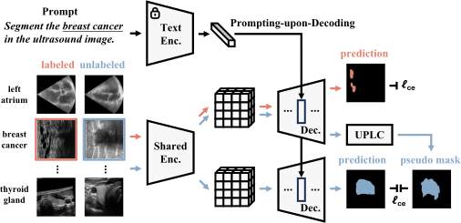
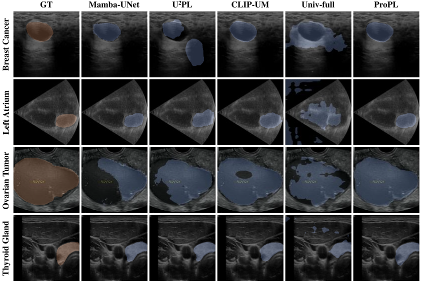

# ProPL: Universal Semi-Supervised Ultrasound Image Segmentation via Prompt-Guided Pseudo-Labeling

This is the official pytorch implementation of our AAAI 2026 paper "ProPL: Universal Semi-Supervised Ultrasound Image Segmentation via Prompt-Guided Pseudo-Labeling". In this paper we propose a Prompt-Guide Pseudo-Labeling Segmentation model (ProPL) to segment multiple organs on ultrasound images with task prompts.



## Usage

### Installation

1. Clone this repo.

   ```
   git clone https://github.com/WUTCM-Lab/ProPL.git
   cd ProPL
   ```

### Pre-processing

- Step 1:
  Install the ConvNeXt-tiny weight from [facebook/convnext-tiny-224 · Hugging Face](https://huggingface.co/facebook/convnext-tiny-224)
  Set the parameter `--vision_type` to the weight path
  
- Step 2:

  Install the BERT weight from [microsoft/BiomedVLP-CXR-BERT-specialized · Hugging Face](https://huggingface.co/microsoft/BiomedVLP-CXR-BERT-specialized)

  Set the parameter `--bert_type` to the BERT weight path

### Training and Test

1. Training the model

   ```
   sh tn3k.sh
   ```

   - `--root`: Training and test data source
   - `--batch_size`: Set the training batch size
   - `--dataset`: The dataset code
   - `--drop_times`: The number of perturbations on visual representation
   - `--expID`: The data split protocols: '1' is the 1/8 data partition; '2' is the 1/16 data partition; '3' is the 1/4 data partition
   - `--ckpt_name`: The checkpoint name of model

2. Testing the model

   ```
   sh tn3k_test.sh
   ```

   - `--mode`: Segmentation target
   - `--expID`: The model training on corresponding data partition
   - `--ckpt_name`: The trained model checkpoint name



## Citation

If this code is helpful for your study, please cite:

```
@article{Chen_Wang_Li_Hu_Shi_Xiong_Zhu_Mou_2026, 
			title={ProPL: Universal Semi-Supervised Ultrasound Image Segmentation via Prompt-Guided Pseudo-Labeling}, 
			volume={40}, url={https://ojs.aaai.org/index.php/AAAI/article/view/37303}, 
			DOI={10.1609/aaai.v40i4.37303}, 
			number={4}, 
			journal={Proceedings of the AAAI Conference on Artificial Intelligence}, 
			author={Chen, Yaxiong and Wang, Qicong and Li, Chunlei and Hu, Jingliang and Shi, Yilei and Xiong, Shengwu and Zhu, Xiao Xiang and Mou, Lichao}, 
			year={2026}, 
			month={Mar.}, 
			pages={3101-3110} }
```

